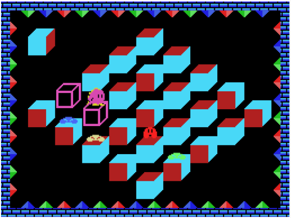

ReQbert - A HTML 5 MSX Q*bert game remake
=========================================

A project by Leonardo Nicolas in memory of Luciano Sother.

## Introduction

ReQbert is a browser-based remake of the MSX version of the game Q*bert.

It’s an open source, non-profit project, initiated by two brazilian guys —
Luciano Sother and Leonardo Nicolas — as a
way to exercise their skills in HTML5 and Javascript during their scarce
spare-time.

This game was chosen because Sother and Nicolas, in their childhood, were fans
of MSX games, specially those published by Konami. So, we’ve searched for
Konami’s MSX titles and this game was the first that we thought is cool enough
to deserve a remake and, surprisingly, we didn’t find any remake of it.

We’ll post any information about the game’s development progress, such as
challenges and solutions, decisions being made, tips etc., in the blog,
allowing interested people to read and give us feedback.

Be welcome and have fun!

## 1. Working in progress

This game is constantly receiving new features and modifications. The last build can be played through the link https://leonicolas.github.io/ReQbert/

Last build screenshot:

## 2. How it works

This game is being developed in pure HTML 5 and Javascript with 2D Canvas rendering.
I'm using [Webpack](https://webpack.js.org/) to create the game bundles and [Babel](https://babeljs.io/)
to transpile the new Javascript syntax to the syntax known by the browser.

All game sprites are saved in PNG files and they were drawn using [Gimp](https://www.gimp.org/).
The game specifications like levels, sprites map and backgrounds are saved in JSON files.

## 3. Installation

* Clone the project.
* Run the command `npm run start:dev`.

## 4. Requisites

* A modern browser like Chrome, Firefox, Opera or Safari.
* NodeJS version 10 or greater.

## 5. How to play

Your objective is to rotate the cubes until they reach the position shown by the reference cube located at the top left corner of the level. When a cube is rotated until the expected position it is marked as cleared.

To clear the level it's necessary to clear 5 cubes in a  vertical, horizontal or diagonal line.

To move Qbert use the arrow keys in the diagonal way. Eg.: [ &#8681; ] + [ &#8678; ]

## 5. Acknowledgements

## 6. Legal

Released under the GPLv3 license.
For full details see the LICENSE file included in this distribution.
